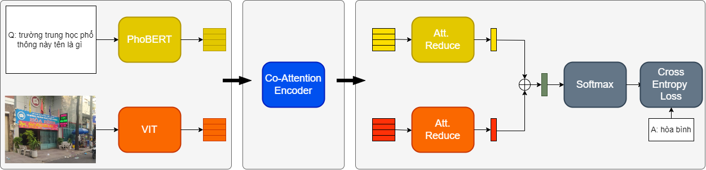

# Project Name
Deep Modular Co-Attention Networks For VQA In Vietnamese

## 1.Overview
By using the commonly used bottom-up-attention visual features, a single MCAN model delivers 55.48% overall accuracy on the test split of ViVQA dataset respectively, which significantly outperform existing state-of-the-arts model in Vietnamese. Please check "ViVQA: Vietnamese Visual Question Answering" [paper](https://aclanthology.org/2021.paclic-1.72/) for details.

[Link to demo](https://huggingface.co/spaces/windy2612/ViVQA)

## 2.Code structure
- `Model.py` : Script for define model architecture

- `Make_dataset.py` : Script for generate dataset

- `Train.py` : Script for training model

- `Predict.py` : Script for generate answer

- `App.py` : Script for deploy model

## 3.Dataset

The ViVQA dataset is a large-scale Vietnamese Visual Question Answering dataset. It includes more than 10000 images with corresponding questions and answers in Vietnamese, covering various topics and image types. This dataset supports the development of VQA systems for the Vietnamese language, advancing computer vision and natural language processing research.

[Link to paper](https://aclanthology.org/2021.paclic-1.72.pdf)
[Link to dataset](https://www.kaggle.com/datasets/nguyenphongocd/vivqa-windy/data)

## 4.Model architecture

This repository corresponds to the PyTorch implementation of the MCAN [paper](https://openaccess.thecvf.com/content_CVPR_2019/papers/Yu_Deep_Modular_Co-Attention_Networks_for_Visual_Question_Answering_CVPR_2019_paper.pdf) for VQA in Vietnamese

## 5.Demo
Here is some demos from my application

